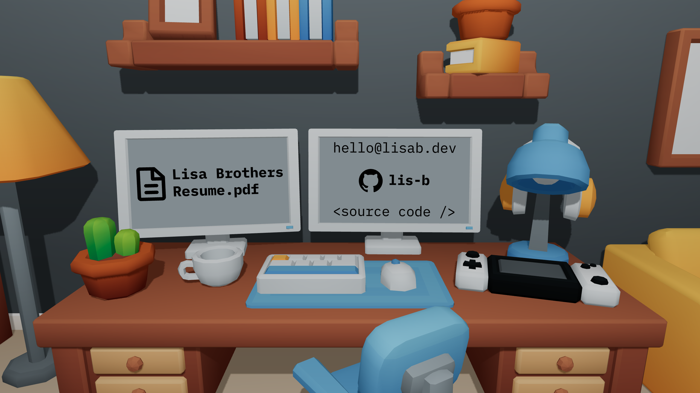

# 3D Portfolio

I built this simple little portfolio so I could have something while working on a bigger and better project. :)

## Assets

- [Furniture Bits by Kay Lousberg](https://kaylousberg.itch.io/furniture-bits)
  - I purchased this kit to support the creator (not required), and created a wall, baseboard, and floor with the textures in Blender as well as UV edited a lamp.
- PD icons from [Simple Icons](https://simpleicons.org/) and [SVGRepo](https://www.svgrepo.com/)
- [IBM Plex Mono Font](https://fonts.google.com/specimen/IBM+Plex+Mono) 

## Further work
- [ ] Include performance monitor to enable/disable shadows
  - [ ] Alternatively, bake shadows and remap in Blender(?)
- [ ] Add a projects section(?)
- [ ] Add a link to [Detoxolotl](https://github.com/Detoxolotl/Detoxolotl) on the game console
- [ ] Create a better fallback page
